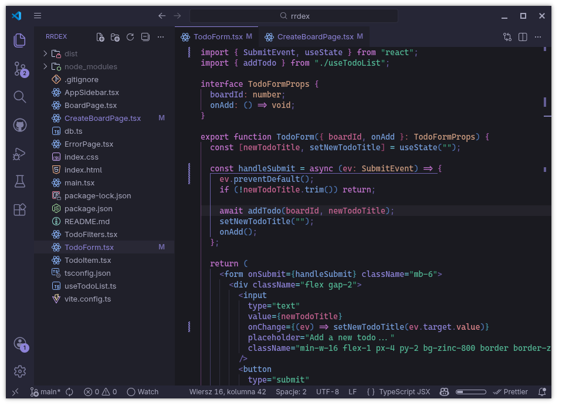

# Technicolor Theme

## Recommended fonts

- [Lilex](https://lilex.myrt.co/)
- [Cascadia Code](https://github.com/microsoft/cascadia-code)
- [Fantasque Sans Mono](https://github.com/belluzj/fantasque-sans)

## Recommended options

- [`bracketPairColorization`](vscode://settings/editor.bracketPairColorization.enabled): **false** – This theme already adds colors to brackets based on their semantics.